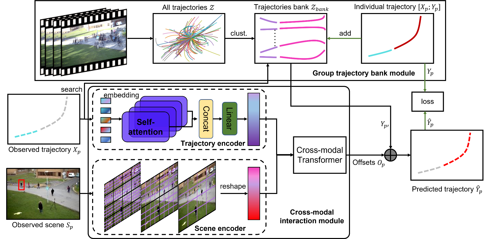

# Forecasting Human Trajectory from Scene History

This repository contains the official implementation of our paper: Forecasting Human Trajectory from Scene History. Mancheng Meng, Ziyan Wu, Terrence Chen, Fan Yang, Dinggang Shen. NeurIPS 2022.



**Abstract:** Predicting the future trajectory of a person remains a challenging problem, due to randomness and subjectivity. However, the moving patterns of human in a constrained scenario typically conform to a limited number of regularities to a certain extent, because of the scenario restrictions (e.g., floor plan, roads, and obstacles) and person-person or person-object interactivity. Thus, an individual person in this scenario should follow one of the regularities as well. In other words, a person’s subsequent trajectory has likely been traveled by others. Based on this hypothesis, we propose to forecast a person’s future trajectory by learning from the implicit scene regularities. We call the regularities, inherently derived from the past dynamics of the people and the environment in the scene, scene history. We categorize scene history information into two types: historical group trajectory and individual-surroundings interaction. To exploit these information for trajectory prediction, we propose a novel framework Scene History Excavating Network (SHENet), where the scene history is leveraged in a simple yet effective approach. In particular, we design two components: the group trajectory bank module to extract representative group trajectories as the candidate for future path, and the cross-modal interaction module to model the interaction between individual past trajectory and its surroundings for trajectory refinement, respectively. In addition, to mitigate the uncertainty in ground truth trajectory, caused by the aforementioned randomness and subjectivity, we propose to include smoothness into training process and evaluation metrics. We conduct extensive evaluations to validate the efficacy of proposed framework on ETH, UCY, as well as a new, challenging benchmark dataset PAV, demonstrating superior performance compared to state-of-the-art methods.

## Installation

### Environment Setup

- OS: Linux
- python: 3.7.0
- pytorch: 1.11.0+cu102

We cam create a conda environment use the following commands.

```
conda create --name SHENet
source activate SHENet
pip install -r requirements.txt
```

### Data Setup

- **PAV** dataset: Download the videos from [MOT15](https://motchallenge.net/data/MOT15/), and preprocess the  data and annotations using the code ./preprocess/mot15_wrapper.py, or you can use our preprocessed data [PAV](https://pan.baidu.com/s/1qXljRC0wKCCpFqeqzEE3AA)(password:7k7k).
- **ETH/UCY** dataset:  Download the video from [UCY](https://graphics.cs.ucy.ac.cy/research/downloads/crowd-data) and [ETH](https://data.vision.ee.ethz.ch/cvl/aem/ewap_dataset_full.tgz), and convert the raw video to the frames using the code ./preprocess/video2image.py. And we use the preprocesed data from [ynet](https://github.com/HarshayuGirase/Human-Path-Prediction/tree/master/ynet). Since a video from UNIV is not available, we use the fewer frames and provide the changed data [ETH/UCY](https://pan.baidu.com/s/1qXljRC0wKCCpFqeqzEE3AA)(password:7k7k).

### pretrained models

We provide a set of [pretrained models](https://pan.baidu.com/s/1qXljRC0wKCCpFqeqzEE3AA)(password:7k7k) as follows:

- Initial trajectory bank on PAV;
- Final trajectory bank to store group trajectories;
- Our full model.

## Model training and evaluation

### Code structure

The general structure of the project is as follows.

1. utils/parser.py: training and testing options, default setttings.
2. datasets: to process the origin data
3. demo: some cluster examples and visualization scripts.
4. model: our model structure
5. tools: train/test our model

**command line arguments**

```
-- data_dir (path to the dataset directories)
-- input_n (number of model's input frames)
-- output_n (number of model's output frames)
-- origin_d_tra (dimensions of the origin trajectory dim)
-- origin_d_scene (dimensions of the scene feature dim)
-- input_dim (dimensions of the input coordinates)
-- output_dim (dimensions of the output dim)
-- embed_dim (dimensions of the embed dimensions)
-- vit_config_file (config_file of pretrained scene model)
-- vit_checkpoint_file (pretrained scene model)
-- gpus (gpus ids)
-- n_epochs (number of epochs to train)
```

### Usage
1. train : python train.py --args
2. test: python test.py  --args

## Acknowledgement
Thanks for the preprocessed data and code from [ynet](https://github.com/HarshayuGirase/Human-Path-Prediction/tree/master/ynet).
